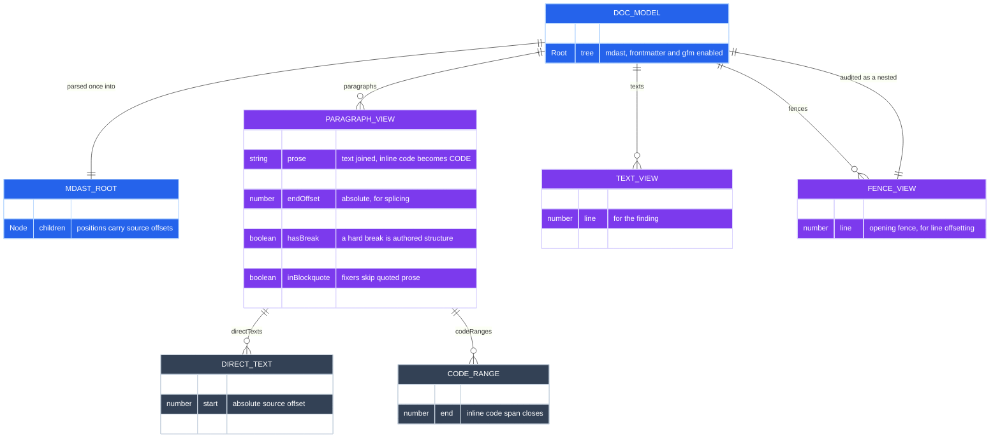
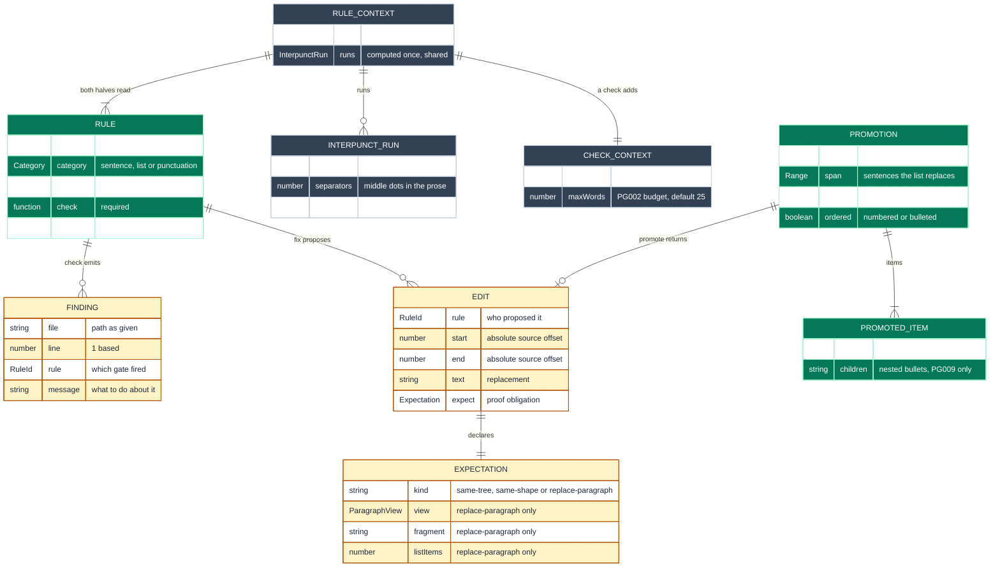
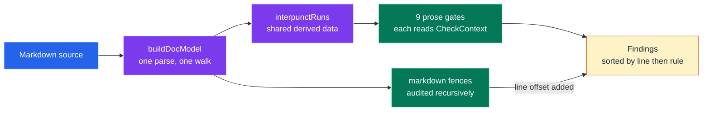
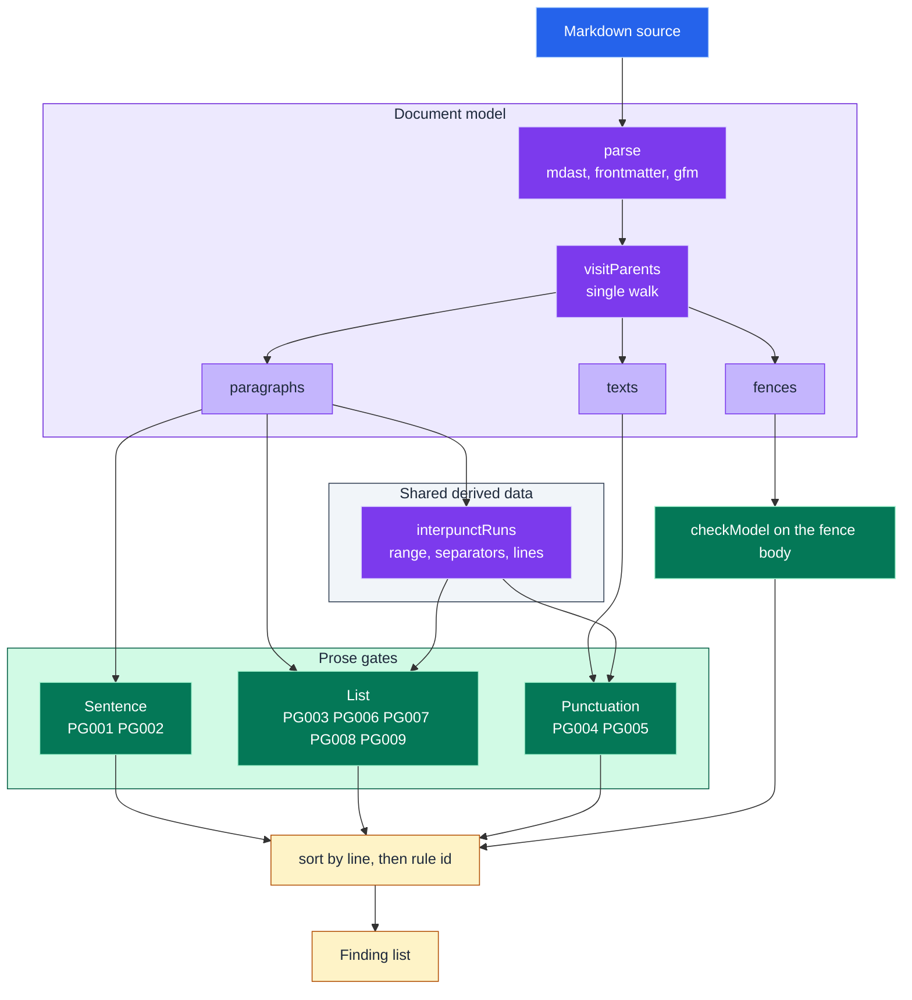
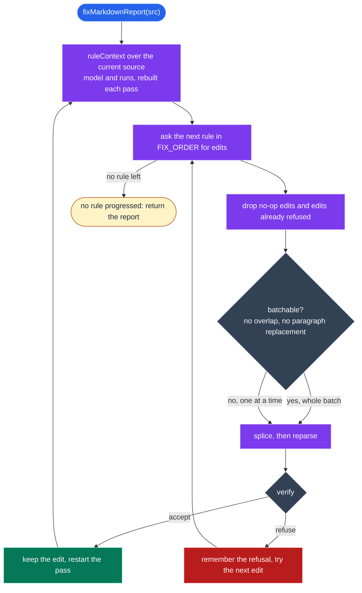
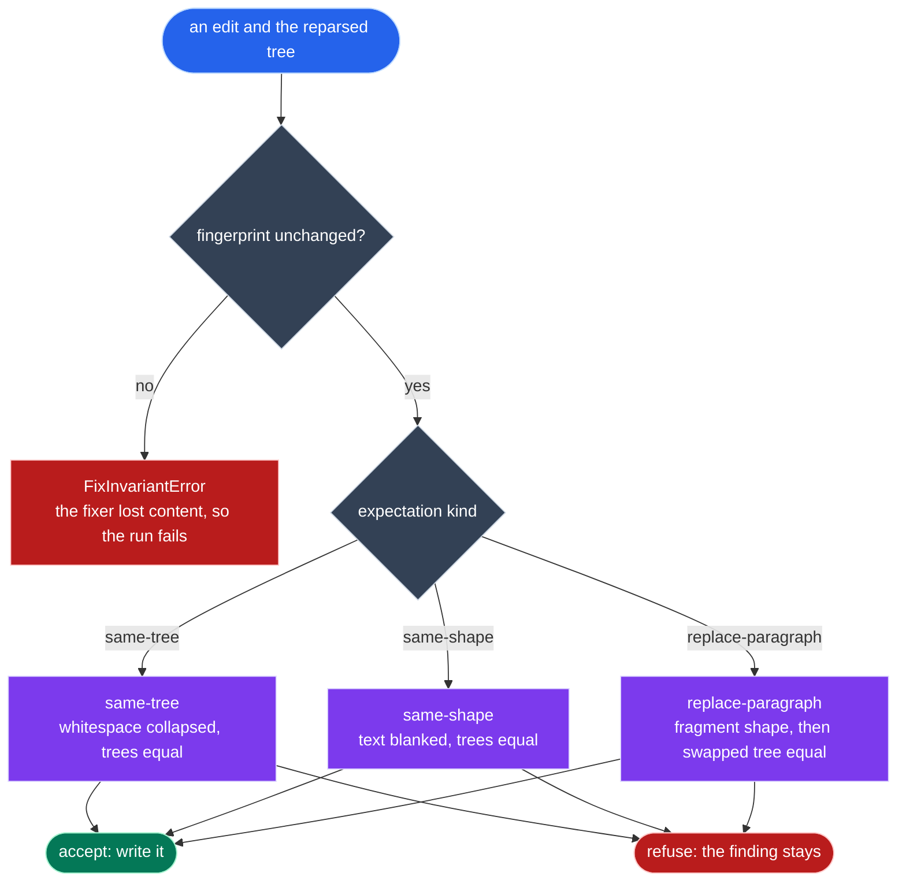
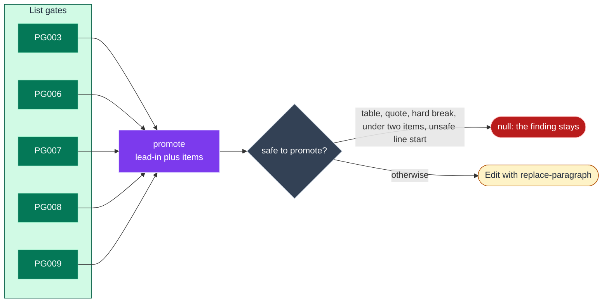

# Data Model

How a markdown file becomes findings and fixes, and what every prose gate reads to do its work.

Read this before writing a new rule or changing a fixer.
It is the map behind `src/model.ts`, `src/rules/types.ts` and `src/fix/`.

`RULES.md` shows what each gate catches.
This document shows the shapes the gates are built from.

## Contents

- [The two models](#the-two-models)
- [Document model](#document-model)
- [Rule model](#rule-model)
- [Check pipeline](#check-pipeline)
- [Fix pipeline](#fix-pipeline)
- [Verification](#verification)
- [Fix order](#fix-order)
- [Extending the model](#extending-the-model)

## The two models

There are exactly two data models in this package.

The **document model** is built once per file and is read only.
It flattens the mdast tree into the views a rule needs, so no rule walks the tree itself.

The **rule model** is the contract a prose gate implements.
A rule turns the document model into findings, and optionally into edits the engine may apply.

Code spans, code blocks, tables and frontmatter are exempt by construction, never by pattern matching.
A fence tagged `markdown` or `md` is the one exception, since it holds a template whose body is audited recursively.

## Document model

`buildDocModel` parses the source once, then walks the tree once, filling three views.



*The document model, built once per file.* | 7 entities, VCS 10.5

Three distinctions carry most of the weight.

`raw` versus `prose`.
`raw` is the exact source slice a fixer splices over.
`prose` is what a check reads, with soft wraps collapsed and each inline code span replaced by the single token `CODE`.

`texts` versus `directTexts`.
`texts` holds every prose text node in the document, including headings and list items.
`directTexts` holds only the text nodes that are immediate children of their paragraph.
Text inside a link, emphasis or code span is cargo, so a fixer may move it whole but never split inside it.

Offsets versus values.
Every offset is absolute into `src`, and is only valid for the source it was computed from.
`matchesIn` refuses whenever a source slice and its parsed value disagree, which is how an entity or an escape stops a fixer.

## Rule model

A rule is data plus two functions.
The catalogue in `src/rules/index.ts` is the only registry.



*The rule contract and what it produces.* | 9 entities, VCS 12.5

`ruleContext` builds the shared half once per document, and both halves of every rule read it.
A check adds the file it reports against and the sentence budget; a fix needs nothing more, so `FixContext` is `RuleContext`.
An interpunct run is the one piece of derived data shared between rules.
It is what lets PG005 stay quiet inside a run that PG006 or PG009 already reports.

## Check pipeline

Checking never mutates anything.



*Check path.* | 6 nodes, VCS 9.0

<details>
<summary>Complete check pipeline, with the shared data each gate reads (17 nodes)</summary>



</details>

Every gate reads the same `CheckContext`, which is the shared `RuleContext` plus the file it reports against and the sentence budget.
A gate never writes a file, never mutates the model and never sees another gate's output.

## Fix pipeline

Fixing is a fixpoint loop over splice edits.
Offsets are only valid for the source they were computed from, so every accepted edit restarts the pass.



*The fixpoint loop in `src/fix/engine.ts`.* | 10 nodes, VCS 17.0

A refused edit is remembered by the triple of rule, source slice and replacement text.
It stays refused while that slice is unchanged, so a stubborn fixer cannot spin the loop.
The loop throws after ten thousand passes, which means a fixer is proposing an edit it never converges on.

## Verification

A fixer proposes.
The engine, not the fixer, decides whether an edit is safe to keep.



*Two obligations, in order.* | 9 nodes, VCS 15.0

The fingerprint is every word, url, alt text and code value of the document, in order.
Joining conjunctions and enumeration markers are excluded, because a fixer is allowed to rewrite those.
A fingerprint change is a bug in the fixer, so it throws rather than refusing.

The expectation is a claim about structure that the fixer could not fully verify from inside one paragraph.
A mismatch means a context the fixer could not see, so the edit is refused and the finding stays for a human.

| Expectation | Claim | Comparison | Used by |
|---|---|---|---|
| `same-tree` | Whitespace moved and nothing else | Trees equal once text whitespace is collapsed | PG001 |
| `same-shape` | Glyphs swapped inside text | Trees equal once every text value is blanked | PG004, PG005 |
| `replace-paragraph` | One paragraph became a lead-in and a list | Fragment has the declared shape, and swapping it into the old tree reproduces the new tree | PG003, PG006, PG007, PG008, PG009 |

## Fix order

Structure first, then glyphs, then layout.
A promotion needs the separators a glyph swap would erase, and reflow only makes sense over settled blocks.


*`FIX_ORDER` in `src/rules/index.ts`.* | 8 nodes, VCS 11.5

PG002 has no fixer.
Shortening a sentence changes its words, and that needs discretion.

The five list gates share one fixer helper, `promote`, in `src/fix/promote.ts`.
Each gate decides where the list starts and what each item is, then hands `promote` a `Promotion`.
Item text is sliced from the source and never re-serialised, so links, emphasis, escapes and code spans travel unchanged.



*The shared promotion path.* | 9 nodes, VCS 17.6

## Extending the model

### Adding a rule

One rule is one file, named `src/rules/pgNNN-slug.ts`, exporting one `Rule`.

Every rule module has the same shape, so a reader who has read one has read them all.

```ts
// What the rule guards, and what the fix will and will not do.

import ...

// Rule-local constants and helpers, each with the reason it exists.

const check: Rule["check"] = (ctx) => { ... };

const fix: Rule["fix"] = (ctx) => { ... };

export const pgNNN: Rule = { id: RULE.NAME, category: "...", summary: "...", check, fix };
```

1. Pick the next free id and add it to the `RULE` map in `src/rules/types.ts`.
2. Choose a category from `CATEGORIES`, which is what groups the rule in help and in `RULES.md`.
3. Write `check`, reading only `CheckContext`.
   Skip `inTable` paragraphs unless the rule is about a glyph.
4. Write `fix` if the rule can be fixed without discretion, and leave it out if it cannot.
   A fix reads `FixContext`, which is the same shared data the check read.
   Data derived from the whole document belongs in `ruleContext`, never recomputed inside the rule.
5. Register the rule in `RULES` in `src/rules/index.ts`, in id order.
6. Place it in `FIX_ORDER` if it has a fixer, respecting the structure before glyphs before layout sequence.
7. Add a section to `RULES.md` under the rule's category heading.
   `tests/rules-doc.test.ts` holds that document to the code, so a missing section fails CI.
8. Add an adversarial test under `tests/adversarial/` and a fixture pair under `tests/fixtures/fix/` if the rule fixes.

Nothing else needs to change.
The CLI help, the category grouping and the documentation test all read the catalogue.

### Choosing an expectation

The expectation is the strongest claim the edit can honestly make.

Reach for `same-tree` when the edit only moves whitespace.
Reach for `same-shape` when the edit swaps glyphs inside text and leaves node boundaries alone.
Reach for `replace-paragraph` when one paragraph becomes several blocks.

A weaker claim is not safer.
`same-shape` blanks text before comparing, so it would wave through an edit that changed a word.
That is why the fingerprint check runs first, and runs unconditionally.

### Reusing the helpers

| Helper | Module | Use it for |
|---|---|---|
| `words` | `model.ts` | Counting the words of a sentence or an item, the one way every rule counts them |
| `matchesIn` | `fix/spans.ts` | Absolute offsets of a pattern inside one text node, or null when source and value disagree |
| `matchesInAll` | `fix/spans.ts` | The same across every direct text of a paragraph |
| `splittableSeparators` | `fix/spans.ts` | Every separator a fixer may split on, or null when one of them cannot be trusted |
| `sentenceSpan` | `fix/spans.ts` | The sentence bounds covering a range a fixer found |
| `sentenceSpans` | `fix/spans.ts` | Every sentence of a paragraph, in order |
| `spansBetween` | `fix/spans.ts` | The spans a run of cut points carves out, with the fencepost written once |
| `escaped` | `fix/spans.ts` | Refusing a glyph the author escaped |
| `collapse` | `fix/spans.ts` | Folding soft line breaks into single spaces |
| `first`, `last` | `fix/ends.ts` | The ends of a list a rule has already proved non-empty, without a cast per rule |
| `promote` | `fix/promote.ts` | Turning a span into a lead-in and a real markdown list |
| `cleanItem` | `fix/promote.ts` | Trimming a trailing separator or a joining conjunction off one item |
| `itemsOf` | `fix/promote.ts` | A run of source spans as cleaned item text, in document order |
| `itemsBetween` | `fix/promote.ts` | The same from cut points: the shared body of every hidden-list fixer |
| `cleanLeadIn` | `fix/promote.ts` | Normalising the text before a promoted list to end in a colon |
| `ruleContext` | `rules/index.ts` | Building the shared half of the context once per document |
| `interpunctRuns` | `rules/interpunct.ts` | The shared run data behind PG005, PG006 and PG009 |
| `isFlat`, `isStacked` | `rules/interpunct.ts` | Partitioning runs into the flat ones PG006 owns and the stacked ones PG009 owns |

### Rules the extension must not break

- A fixer never guesses.
  An ambiguous case returns no edit, and the finding stays.
- A fixer never re-serialises prose.
  Item and sentence text is sliced from the source.
- An offset belongs to one source.
  Recompute after every accepted edit, which the engine already does by restarting the pass.
- A fence tagged `markdown` or `md` is check only.
  No fix ever rewrites through a fence boundary.
- A fix bug gets its adversarial test before it gets its fix.

## See also

- [`RULES.md`](../RULES.md) for a failing example and the fix for every gate.
- [`GLOSSARY.md`](../GLOSSARY.md) for the canonical name of every term used here.
- [`adrs/index.md`](../adrs/index.md) for the decisions behind these shapes.
- [`CONTRIBUTING.md`](../CONTRIBUTING.md) for setup and how a change is accepted.
