# Data Model

How a markdown file becomes findings and fixes, and what every prose gate reads to do its work.

Read this before writing a new rule or changing a fixer.
It is the map behind `src/model.ts`, `src/query.ts`, `src/rules/types.ts` and `src/fix/`.

`RULES.md` shows what each gate catches.
This document shows the shapes the gates are built from.

## Contents

- [The two models](#the-two-models)
- [Document model](#document-model)
- [Rule model](#rule-model)
- [Check pipeline](#check-pipeline)
- [Fix pipeline](#fix-pipeline)
- [Verification](#verification)
- [Fix order](#fix-order)
- [Registry and plugins](#registry-and-plugins)
- [Extending the model](#extending-the-model)

## The two models

There are exactly two data models in this package.

The **document model** is built once per file and is read only.
It flattens the mdast tree into the views a rule needs, so no rule walks the tree itself.

The **rule model** is the contract a prose gate implements.
A rule turns the document model into findings, and optionally into edits the engine may apply.

Code spans, code blocks, tables and frontmatter are exempt by construction, never by pattern matching.
A fence tagged `markdown` or `md` is the one exception, since it holds a template whose body is audited recursively.

## Document model

`buildDocModel` parses the source once, then walks the tree once, filling the views.
Each lens below shows an overview first, then a detailed reference you can open.

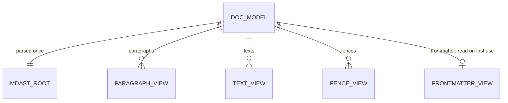
```mermaid
erDiagram
    DOC_MODEL ||--|| MDAST_ROOT : "parsed once"
    DOC_MODEL ||--o{ PARAGRAPH_VIEW : paragraphs
    DOC_MODEL ||--o{ TEXT_VIEW : texts
    DOC_MODEL ||--o{ FENCE_VIEW : fences
    DOC_MODEL ||--o| FRONTMATTER_VIEW : "frontmatter, read on first use"
```

*Overview: the document model is one tree and four views.*

<details>
<summary>Detail: every view and its fields</summary>

The paragraph view and what hangs off it.

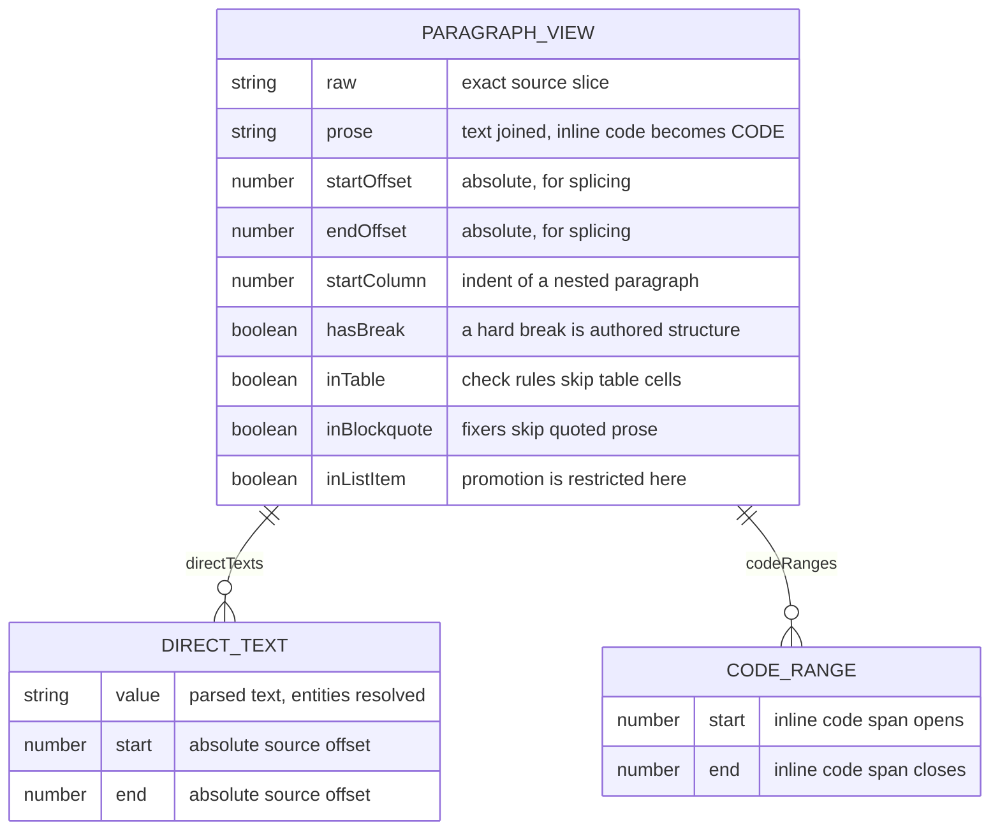
```mermaid
erDiagram
    PARAGRAPH_VIEW ||--o{ DIRECT_TEXT : "directTexts"
    PARAGRAPH_VIEW ||--o{ CODE_RANGE : "codeRanges"

    PARAGRAPH_VIEW {
        string raw "exact source slice"
        string prose "text joined, inline code becomes CODE"
        number startOffset "absolute, for splicing"
        number endOffset "absolute, for splicing"
        number startColumn "indent of a nested paragraph"
        boolean hasBreak "a hard break is authored structure"
        boolean inTable "check rules skip table cells"
        boolean inBlockquote "fixers skip quoted prose"
        boolean inListItem "promotion is restricted here"
    }
    DIRECT_TEXT {
        string value "parsed text, entities resolved"
        number start "absolute source offset"
        number end "absolute source offset"
    }
    CODE_RANGE {
        number start "inline code span opens"
        number end "inline code span closes"
    }
```

The model and its other views.

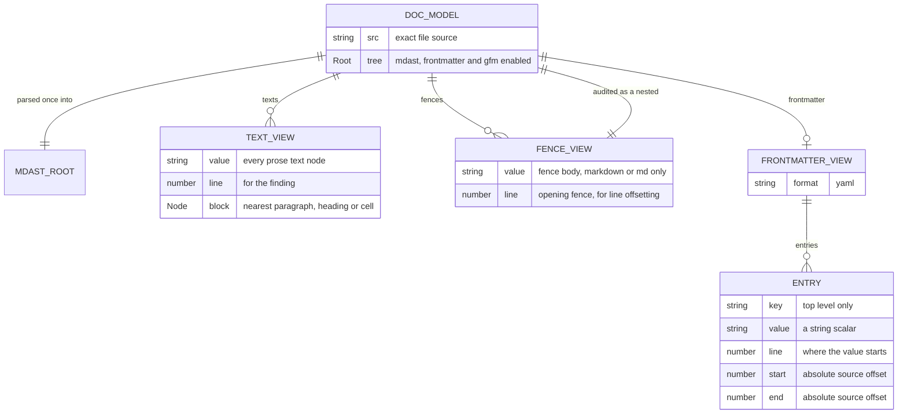
```mermaid
erDiagram
    DOC_MODEL ||--|| MDAST_ROOT : "parsed once into"
    DOC_MODEL ||--o{ TEXT_VIEW : "texts"
    DOC_MODEL ||--o{ FENCE_VIEW : "fences"
    DOC_MODEL ||--o| FRONTMATTER_VIEW : "frontmatter"
    FRONTMATTER_VIEW ||--o{ ENTRY : "entries"
    FENCE_VIEW ||--|| DOC_MODEL : "audited as a nested"

    DOC_MODEL {
        string src "exact file source"
        Root tree "mdast, frontmatter and gfm enabled"
    }
    TEXT_VIEW {
        string value "every prose text node"
        number line "for the finding"
        Node block "nearest paragraph, heading or cell"
    }
    FENCE_VIEW {
        string value "fence body, markdown or md only"
        number line "opening fence, for line offsetting"
    }
    FRONTMATTER_VIEW {
        string format "yaml"
    }
    ENTRY {
        string key "top level only"
        string value "a string scalar"
        number line "where the value starts"
        number start "absolute source offset"
        number end "absolute source offset"
    }
```

*Detail: 8 entities with their fields, in two diagrams.*

</details>

Three distinctions carry most of the weight.

`raw` versus `prose`.
`raw` is the exact source slice a fixer splices over.
`prose` is what a check reads, with soft wraps collapsed and each inline code span replaced by the single token `CODE`.

`texts` versus `directTexts`.
`texts` holds every prose text node in the document, including headings and list items.
`directTexts` holds only the text nodes that are immediate children of their paragraph.
Text inside a link, emphasis or code span is cargo, so a fixer may move it whole but never split inside it.

Offsets versus values.
Every offset is absolute into `src`, and is only valid for the source it was computed from.
`matchesIn` refuses whenever a source slice and its parsed value disagree, which is how an entity or an escape stops a fixer.

## Rule model

A rule is data plus two functions.
`src/rules/index.ts` lists the built-in rules, and `src/rules/registry.ts` builds the registry a run actually uses (see [Registry and plugins](#registry-and-plugins)).

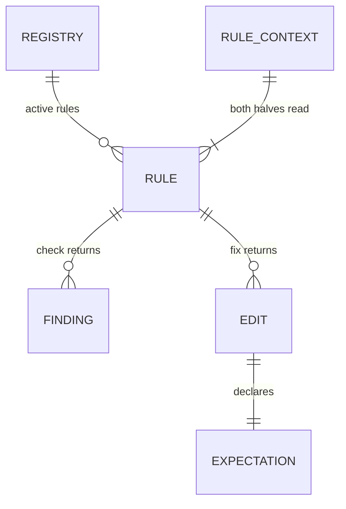
```mermaid
erDiagram
    REGISTRY ||--o{ RULE : "active rules"
    RULE ||--o{ FINDING : "check returns"
    RULE ||--o{ EDIT : "fix returns"
    EDIT ||--|| EXPECTATION : declares
    RULE_CONTEXT ||--|{ RULE : "both halves read"
```

*Overview: a registry holds rules, a rule returns findings and edits, and an edit declares its proof.*

<details>
<summary>Detail: the contract, the contexts and the promotion shape</summary>

The contract: what a registry holds and what a rule returns.

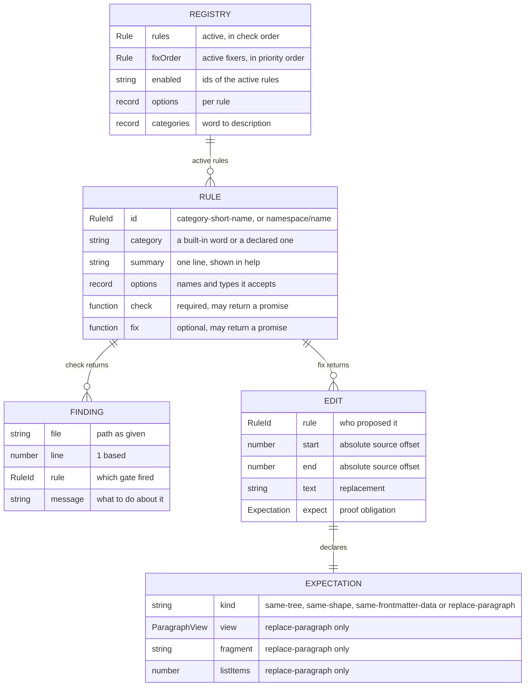
```mermaid
erDiagram
    REGISTRY ||--o{ RULE : "active rules"
    RULE ||--o{ FINDING : "check returns"
    RULE ||--o{ EDIT : "fix returns"
    EDIT ||--|| EXPECTATION : "declares"

    REGISTRY {
        Rule rules "active, in check order"
        Rule fixOrder "active fixers, in priority order"
        string enabled "ids of the active rules"
        record options "per rule"
        record categories "word to description"
    }
    RULE {
        RuleId id "category-short-name, or namespace/name"
        string category "a built-in word or a declared one"
        string summary "one line, shown in help"
        record options "names and types it accepts"
        function check "required, may return a promise"
        function fix "optional, may return a promise"
    }
    FINDING {
        string file "path as given"
        number line "1 based"
        RuleId rule "which gate fired"
        string message "what to do about it"
    }
    EDIT {
        RuleId rule "who proposed it"
        number start "absolute source offset"
        number end "absolute source offset"
        string text "replacement"
        Expectation expect "proof obligation"
    }
    EXPECTATION {
        string kind "same-tree, same-shape, same-frontmatter-data or replace-paragraph"
        ParagraphView view "replace-paragraph only"
        string fragment "replace-paragraph only"
        number listItems "replace-paragraph only"
    }
```

The contexts: what a rule receives.

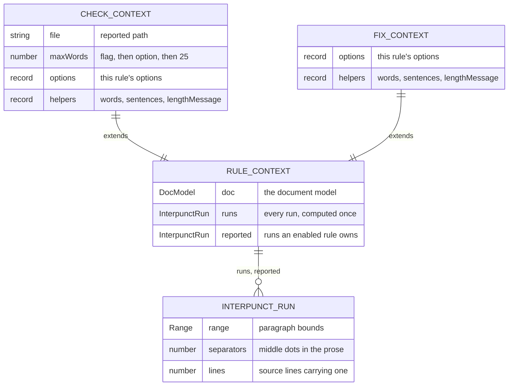
```mermaid
erDiagram
    RULE_CONTEXT ||--o{ INTERPUNCT_RUN : "runs, reported"
    CHECK_CONTEXT ||--|| RULE_CONTEXT : "extends"
    FIX_CONTEXT ||--|| RULE_CONTEXT : "extends"

    RULE_CONTEXT {
        DocModel doc "the document model"
        InterpunctRun runs "every run, computed once"
        InterpunctRun reported "runs an enabled rule owns"
    }
    CHECK_CONTEXT {
        string file "reported path"
        number maxWords "flag, then option, then 25"
        record options "this rule's options"
        record helpers "words, sentences, lengthMessage"
    }
    FIX_CONTEXT {
        record options "this rule's options"
        record helpers "words, sentences, lengthMessage"
    }
    INTERPUNCT_RUN {
        Range range "paragraph bounds"
        number separators "middle dots in the prose"
        number lines "source lines carrying one"
    }
```

The promotion shape the list gates share.

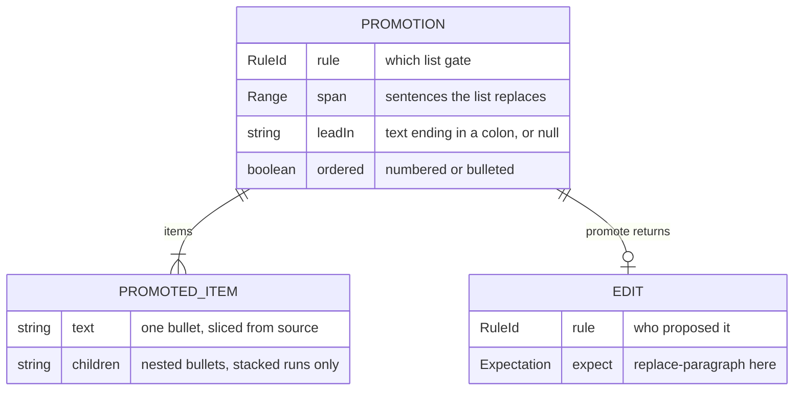
```mermaid
erDiagram
    PROMOTION ||--|{ PROMOTED_ITEM : "items"
    PROMOTION ||--o| EDIT : "promote returns"

    PROMOTION {
        RuleId rule "which list gate"
        Range span "sentences the list replaces"
        string leadIn "text ending in a colon, or null"
        boolean ordered "numbered or bulleted"
    }
    PROMOTED_ITEM {
        string text "one bullet, sliced from source"
        string children "nested bullets, stacked runs only"
    }
    EDIT {
        RuleId rule "who proposed it"
        Expectation expect "replace-paragraph here"
    }
```

*Detail: 11 entities with their fields, in three diagrams.*

</details>

`ruleContext` builds the shared half once per document, and both halves of every rule read it.
A check adds the file it reports against, the sentence budget, its options and the text helpers.
A fix adds its options and the helpers, so `FixContext` is `RuleContext` plus those two.
An interpunct run is the one piece of derived data shared between rules.
`reported` holds the runs an enabled rule owns.
It is what lets punctuation-interpunct-in-prose stay quiet inside a run that list-interpunct-joined-run or list-stacked-interpunct-runs already reports.

## Check pipeline

Checking never mutates anything.
Every active rule is started at once and the engine waits for all of them.
A rule that waits on a tool therefore overlaps with the others.


```mermaid
flowchart LR
    SRC["Markdown<br/>source"]:::source --> MODEL["Build<br/>model"]:::build --> CTX["Build<br/>context"]:::build --> RULES["Run every<br/>rule at once"]:::gate --> OUT["Findings,<br/>sorted"]:::out

    classDef source fill:#2563eb36,stroke:#3b82f6
    classDef build  fill:#7c3aed36,stroke:#8b5cf6
    classDef gate   fill:#05966936,stroke:#10b981
    classDef out    fill:#b4530936,stroke:#d97706
```

*Overview: source to model to context, then every rule, then sorted findings.*

<details>
<summary>Detail: the model, the shared data and the rules each check reads</summary>

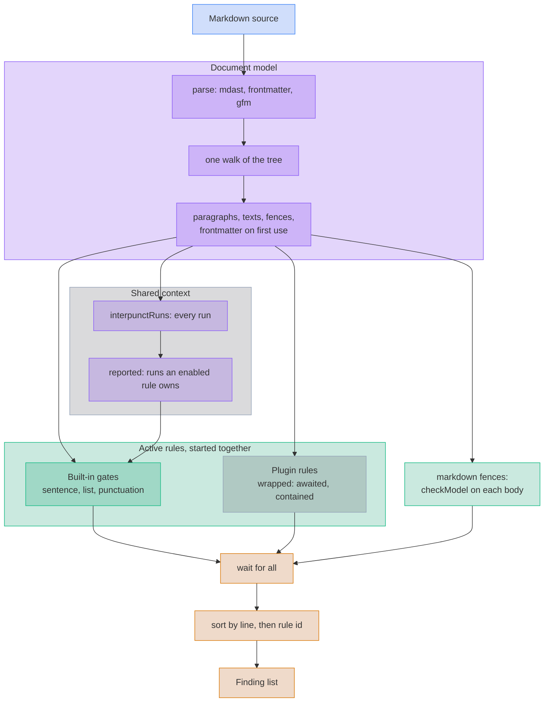
```mermaid
flowchart TB
    SRC["Markdown source"]:::source

    subgraph model["Document model"]
        PARSE["parse: mdast, frontmatter, gfm"]:::build
        WALK["one walk of the tree"]:::build
        VIEWS["paragraphs, texts, fences,<br/>frontmatter on first use"]:::view
    end

    subgraph ctx["Shared context"]
        RUNS["interpunctRuns: every run"]:::build
        REP["reported: runs an enabled rule owns"]:::build
    end

    subgraph rules["Active rules, started together"]
        BUILTIN["Built-in gates<br/>sentence, list, punctuation"]:::gate
        PLUGIN["Plugin rules<br/>wrapped: awaited, contained"]:::ext
    end

    FENCE["markdown fences:<br/>checkModel on each body"]:::gate
    WAIT["wait for all"]:::out
    SORT["sort by line, then rule id"]:::out
    OUT["Finding list"]:::out

    SRC --> PARSE --> WALK --> VIEWS
    VIEWS --> RUNS --> REP
    VIEWS --> BUILTIN
    REP --> BUILTIN
    VIEWS --> PLUGIN
    VIEWS --> FENCE
    BUILTIN --> WAIT
    PLUGIN --> WAIT
    FENCE --> WAIT
    WAIT --> SORT --> OUT

    classDef source fill:#2563eb36,stroke:#3b82f6
    classDef build  fill:#7c3aed36,stroke:#8b5cf6
    classDef view   fill:#7c3aed36,stroke:#8b5cf6
    classDef gate   fill:#05966936,stroke:#10b981
    classDef ext    fill:#52525b36,stroke:#94a3b8
    classDef out    fill:#b4530936,stroke:#d97706

    style model fill:#7c3aed36,stroke:#8b5cf6
    style ctx fill:#52525b36,stroke:#94a3b8
    style rules fill:#05966936,stroke:#10b981
```

*Detail: 13 nodes in three groups.*

</details>

Every rule reads the same `CheckContext`.
That is the shared `RuleContext` plus the file it reports against, the sentence budget, its options and the text helpers.
A rule never writes a file, never mutates the model and never sees another rule's output.
A plugin check that throws, rejects or returns the wrong shape becomes one finding for that rule.

## Fix pipeline

Fixing is a fixpoint loop over splice edits.
Offsets are only valid for the source they were computed from, so every accepted edit restarts the pass.
Each fixer is awaited before the next is asked.
An earlier fixer is asked again after every accepted edit, so one run ends at a stable text.

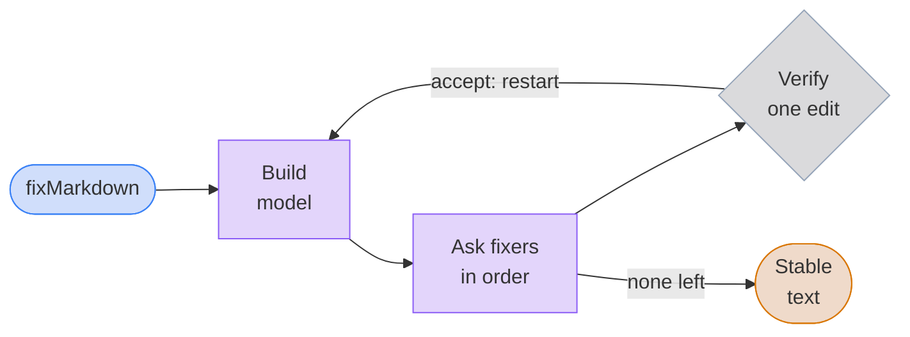
```mermaid
flowchart LR
    START(["fixMarkdown"]):::source --> BUILD["Build<br/>model"]:::build --> ASK["Ask fixers<br/>in order"]:::build --> VERIFY{"Verify<br/>one edit"}:::decide
    VERIFY -- "accept: restart" --> BUILD
    ASK -- "none left" --> DONE(["Stable<br/>text"]):::out

    classDef source fill:#2563eb36,stroke:#3b82f6
    classDef build  fill:#7c3aed36,stroke:#8b5cf6
    classDef decide fill:#52525b36,stroke:#94a3b8
    classDef out    fill:#b4530936,stroke:#d97706
```

*Overview: build, ask, verify, and restart on every accepted edit.*

<details>
<summary>Detail: the loop in src/fix/engine.ts, step by step</summary>

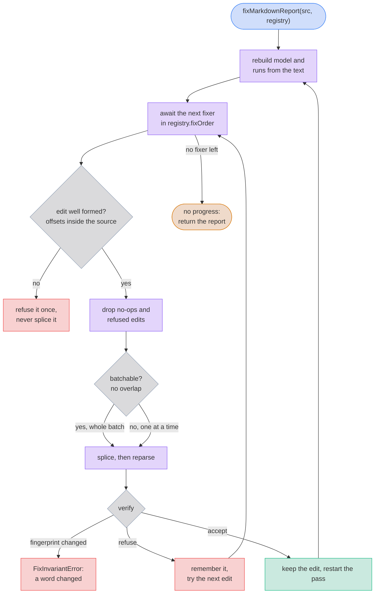
```mermaid
flowchart TB
    START(["fixMarkdownReport(src, registry)"]):::source
    BUILD["rebuild model and<br/>runs from the text"]:::build
    ASK["await the next fixer<br/>in registry.fixOrder"]:::build
    SOUND{"edit well formed?<br/>offsets inside the source"}:::decide
    REJECT["refuse it once,<br/>never splice it"]:::bad
    FILTER["drop no-ops and<br/>refused edits"]:::build
    BATCH{"batchable?<br/>no overlap"}:::decide
    SPLICE["splice, then reparse"]:::build
    VERIFY{"verify"}:::decide
    ACCEPT["keep the edit, restart the pass"]:::ok
    REFUSE["remember it,<br/>try the next edit"]:::bad
    THROW["FixInvariantError:<br/>a word changed"]:::bad
    DONE(["no progress:<br/>return the report"]):::out

    START --> BUILD --> ASK --> SOUND
    SOUND -- "no" --> REJECT
    SOUND -- "yes" --> FILTER --> BATCH
    BATCH -- "yes, whole batch" --> SPLICE
    BATCH -- "no, one at a time" --> SPLICE
    SPLICE --> VERIFY
    VERIFY -- "accept" --> ACCEPT --> BUILD
    VERIFY -- "refuse" --> REFUSE --> ASK
    VERIFY -- "fingerprint changed" --> THROW
    ASK -- "no fixer left" --> DONE

    classDef source fill:#2563eb36,stroke:#3b82f6
    classDef build  fill:#7c3aed36,stroke:#8b5cf6
    classDef decide fill:#52525b36,stroke:#94a3b8
    classDef ok     fill:#05966936,stroke:#10b981
    classDef bad    fill:#dc262636,stroke:#ef4444
    classDef out    fill:#b4530936,stroke:#d97706
```

*Detail: 12 nodes, the fixpoint loop.*

</details>

A refused edit is remembered by the triple of rule, source slice and replacement text.
It stays refused while that slice is unchanged, so a stubborn fixer cannot spin the loop.
The loop throws after ten thousand passes, which means a fixer is proposing an edit it never converges on.

## Verification

A fixer proposes.
The engine, not the fixer, decides whether an edit is safe to keep.

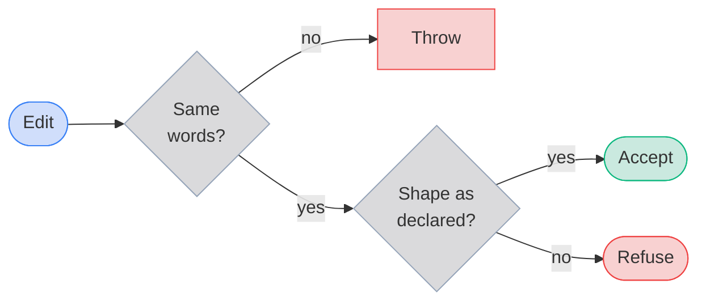
```mermaid
flowchart LR
    EDIT(["Edit"]):::source --> FP{"Same<br/>words?"}:::decide
    FP -- "no" --> THROW["Throw"]:::bad
    FP -- "yes" --> EXP{"Shape as<br/>declared?"}:::decide
    EXP -- "yes" --> OK(["Accept"]):::ok
    EXP -- "no" --> NO(["Refuse"]):::bad

    classDef source fill:#2563eb36,stroke:#3b82f6
    classDef decide fill:#52525b36,stroke:#94a3b8
    classDef ok     fill:#05966936,stroke:#10b981
    classDef bad    fill:#dc262636,stroke:#ef4444
```

*Overview: two obligations, in order.*

<details>
<summary>Detail: the four expectation kinds</summary>

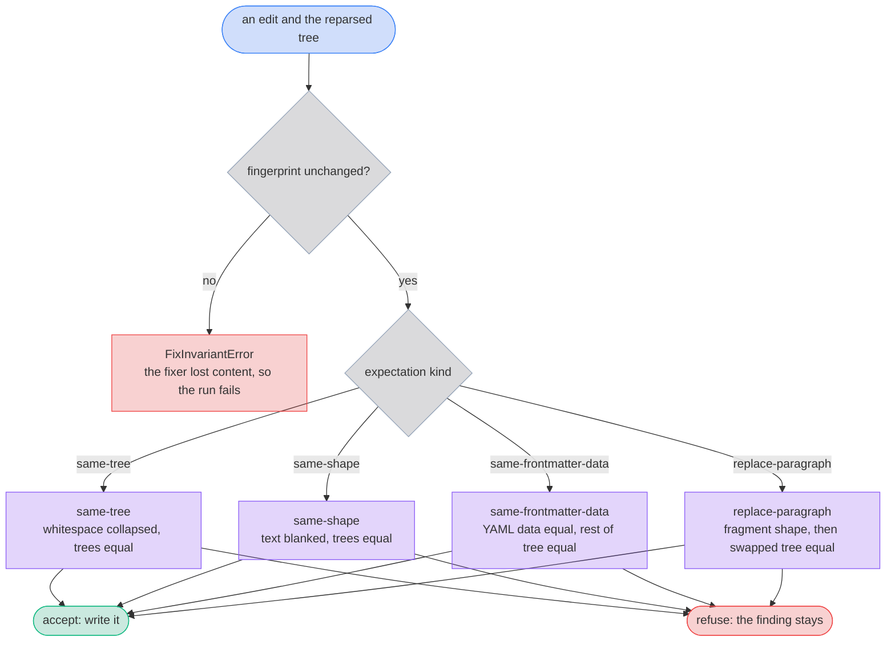
```mermaid
flowchart TB
    EDIT(["an edit and the reparsed tree"]):::source
    FP{"fingerprint unchanged?"}:::decide
    THROW["FixInvariantError<br/>the fixer lost content, so the run fails"]:::bad
    KIND{"expectation kind"}:::decide
    TREE["same-tree<br/>whitespace collapsed, trees equal"]:::build
    SHAPE["same-shape<br/>text blanked, trees equal"]:::build
    FMD["same-frontmatter-data<br/>YAML data equal, rest of tree equal"]:::build
    REPL["replace-paragraph<br/>fragment shape, then swapped tree equal"]:::build
    OK(["accept: write it"]):::ok
    NO(["refuse: the finding stays"]):::bad

    EDIT --> FP
    FP -- "no" --> THROW
    FP -- "yes" --> KIND
    KIND -- "same-tree" --> TREE
    KIND -- "same-shape" --> SHAPE
    KIND -- "same-frontmatter-data" --> FMD
    KIND -- "replace-paragraph" --> REPL
    TREE --> OK
    SHAPE --> OK
    FMD --> OK
    REPL --> OK
    TREE --> NO
    SHAPE --> NO
    FMD --> NO
    REPL --> NO

    classDef source fill:#2563eb36,stroke:#3b82f6
    classDef build  fill:#7c3aed36,stroke:#8b5cf6
    classDef decide fill:#52525b36,stroke:#94a3b8
    classDef ok     fill:#05966936,stroke:#10b981
    classDef bad    fill:#dc262636,stroke:#ef4444
```

*Detail: 9 nodes.*

</details>

The fingerprint is every word, url, alt text and code value of the document, in order.
Joining conjunctions and enumeration markers are excluded, because a fixer is allowed to rewrite those.
A fingerprint change is a bug in the fixer, so it throws rather than refusing.

The expectation is a claim about structure that the fixer could not fully verify from inside one paragraph.
A mismatch means a context the fixer could not see, so the edit is refused and the finding stays for a human.

| Expectation | Claim | Comparison | Used by |
|---|---|---|---|
| `same-tree` | Whitespace moved and nothing else | Trees equal once text whitespace is collapsed | sentence-one-per-line |
| `same-shape` | Glyphs swapped inside text | Trees equal once every text value is blanked | punctuation-em-dash-in-prose, punctuation-interpunct-in-prose |
| `same-frontmatter-data` | Frontmatter written a different way | The YAML parses to identical data, and the tree without its frontmatter is equal | plugin rules, such as the folded-block fixer in `examples/` |
| `replace-paragraph` | One paragraph became a lead-in and a list | Fragment has the declared shape, and swapping it into the old tree reproduces the new tree | list-semicolon-delimited-run, list-interpunct-joined-run, list-inline-enumeration-markers, list-comma-labelled-run, list-stacked-interpunct-runs |

## Fix order

Structure first, then glyphs, then layout.
A promotion needs the separators a glyph swap would erase, and reflow only makes sense over settled blocks.
Plugin fixers are asked after every built-in, in load order.

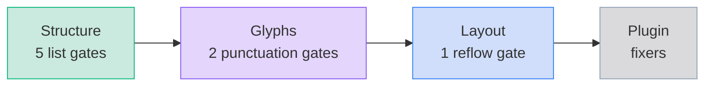
```mermaid
flowchart LR
    S["Structure<br/>5 list gates"]:::list --> G["Glyphs<br/>2 punctuation gates"]:::punc --> L["Layout<br/>1 reflow gate"]:::sent --> P["Plugin<br/>fixers"]:::ext

    classDef list fill:#05966936,stroke:#10b981
    classDef punc fill:#7c3aed36,stroke:#8b5cf6
    classDef sent fill:#2563eb36,stroke:#3b82f6
    classDef ext  fill:#52525b36,stroke:#94a3b8
```

*Overview: the order is a priority list, structure first.*

<details>
<summary>Detail: FIX_ORDER, rule by rule</summary>

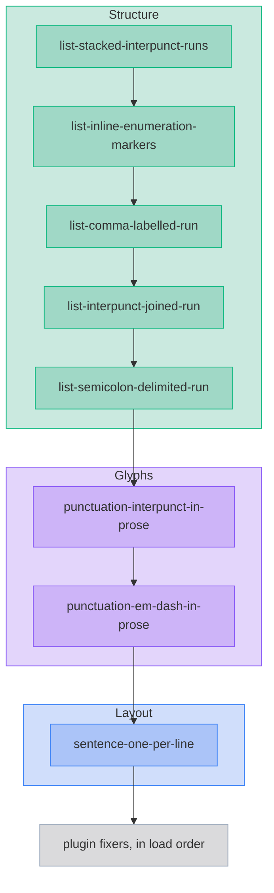
```mermaid
flowchart TB
    subgraph structure["Structure"]
        P9["list-stacked-interpunct-runs"]:::list --> P7["list-inline-enumeration-markers"]:::list --> P8["list-comma-labelled-run"]:::list --> P6["list-interpunct-joined-run"]:::list --> P3["list-semicolon-delimited-run"]:::list
    end
    subgraph glyphs["Glyphs"]
        P5["punctuation-interpunct-in-prose"]:::punc --> P4["punctuation-em-dash-in-prose"]:::punc
    end
    subgraph layout["Layout"]
        P1["sentence-one-per-line"]:::sent
    end
    PLG["plugin fixers, in load order"]:::ext

    P3 --> P5
    P4 --> P1
    P1 --> PLG

    classDef list fill:#05966936,stroke:#10b981
    classDef punc fill:#7c3aed36,stroke:#8b5cf6
    classDef sent fill:#2563eb36,stroke:#3b82f6
    classDef ext  fill:#52525b36,stroke:#94a3b8

    style structure fill:#05966936,stroke:#10b981
    style glyphs fill:#7c3aed36,stroke:#8b5cf6
    style layout fill:#2563eb36,stroke:#3b82f6
```

*Detail: 9 nodes in three groups. `FIX_ORDER` is in `src/rules/index.ts`.*

</details>

sentence-word-budget-exceeded has no fixer.
Shortening a sentence changes its words, and that needs discretion.

The five list gates share one fixer helper, `promote`, in `src/fix/promote.ts`.
Each gate decides where the list starts and what each item is, then hands `promote` a `Promotion`.
Item text is sliced from the source and never re-serialised, so links, emphasis, escapes and code spans travel unchanged.

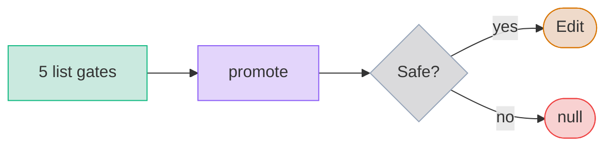
```mermaid
flowchart LR
    GATES["5 list gates"]:::gate --> PROM["promote"]:::build --> GUARD{"Safe?"}:::decide
    GUARD -- "yes" --> EDIT(["Edit"]):::ok
    GUARD -- "no" --> NULL(["null"]):::bad

    classDef gate   fill:#05966936,stroke:#10b981
    classDef build  fill:#7c3aed36,stroke:#8b5cf6
    classDef decide fill:#52525b36,stroke:#94a3b8
    classDef ok     fill:#b4530936,stroke:#d97706
    classDef bad    fill:#dc262636,stroke:#ef4444
```

*Overview: every list gate hands its list to `promote`, which returns an edit or null.*

<details>
<summary>Detail: the shared promotion path</summary>

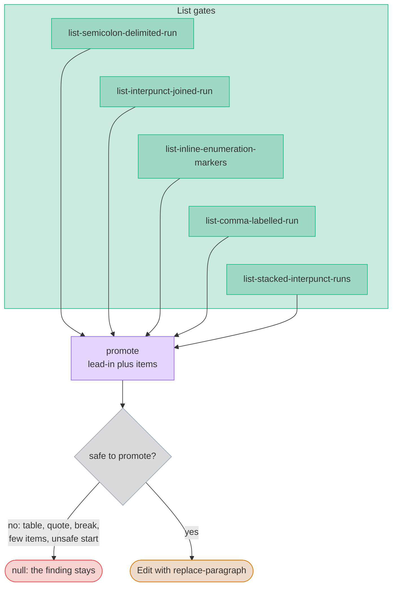
```mermaid
flowchart TB
    subgraph gates["List gates"]
        G3["list-semicolon-delimited-run"]:::gate
        G6["list-interpunct-joined-run"]:::gate
        G7["list-inline-enumeration-markers"]:::gate
        G8["list-comma-labelled-run"]:::gate
        G9["list-stacked-interpunct-runs"]:::gate
    end
    G3 ~~~ G6 ~~~ G7 ~~~ G8 ~~~ G9
    PROM["promote<br/>lead-in plus items"]:::build
    GUARD{"safe to promote?"}:::decide
    NULL(["null: the finding stays"]):::bad
    EDIT(["Edit with replace-paragraph"]):::ok

    G3 --> PROM
    G6 --> PROM
    G7 --> PROM
    G8 --> PROM
    G9 --> PROM
    PROM --> GUARD
    GUARD -- "no: table, quote, break,<br/>few items, unsafe start" --> NULL
    GUARD -- "yes" --> EDIT

    classDef gate   fill:#05966936,stroke:#10b981
    classDef build  fill:#7c3aed36,stroke:#8b5cf6
    classDef decide fill:#52525b36,stroke:#94a3b8
    classDef ok     fill:#b4530936,stroke:#d97706
    classDef bad    fill:#dc262636,stroke:#ef4444

    style gates fill:#05966936,stroke:#10b981
```

*Detail: 9 nodes.*

</details>

## Registry and plugins

A run does not read the built-in list directly.
`setUp` in `src/project.ts` finds the project root, reads the config, loads plugins, and builds a `Registry`.
Check and fix both read that registry, so a rule behaves the same whoever wrote it.

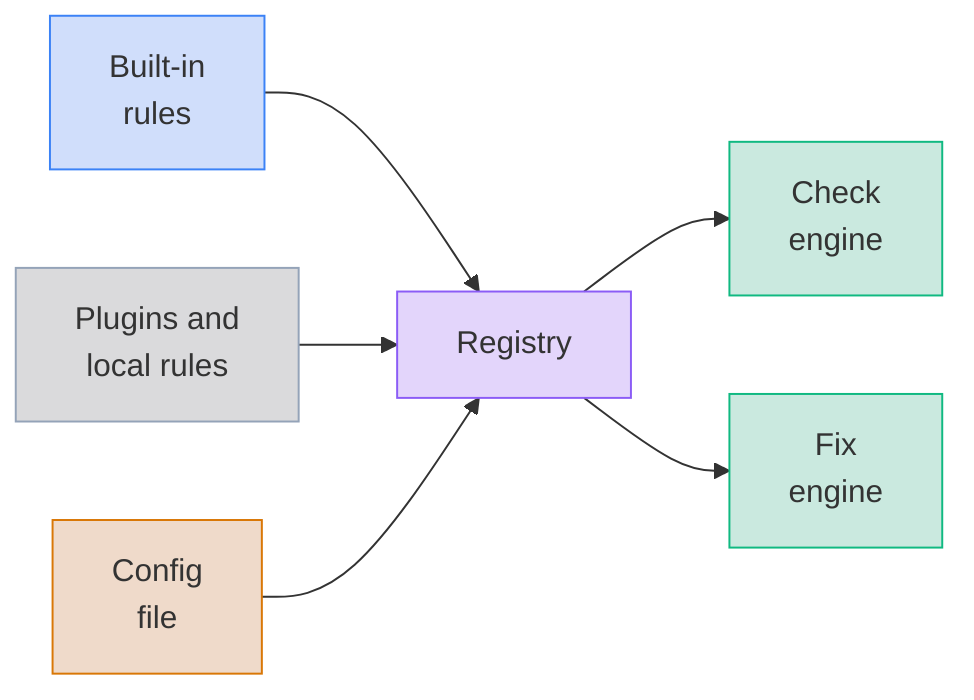
```mermaid
flowchart LR
    BI["Built-in<br/>rules"]:::core --> REG["Registry"]:::build
    PL["Plugins and<br/>local rules"]:::ext --> REG
    CFG["Config<br/>file"]:::source --> REG
    REG --> CHK["Check<br/>engine"]:::gate
    REG --> FIX["Fix<br/>engine"]:::gate

    classDef core   fill:#2563eb36,stroke:#3b82f6
    classDef build  fill:#7c3aed36,stroke:#8b5cf6
    classDef ext    fill:#52525b36,stroke:#94a3b8
    classDef source fill:#b4530936,stroke:#d97706
    classDef gate   fill:#05966936,stroke:#10b981
```

*Overview: three sources feed one registry, and both engines read it.*

<details>
<summary>Detail: what setUp does, in order</summary>

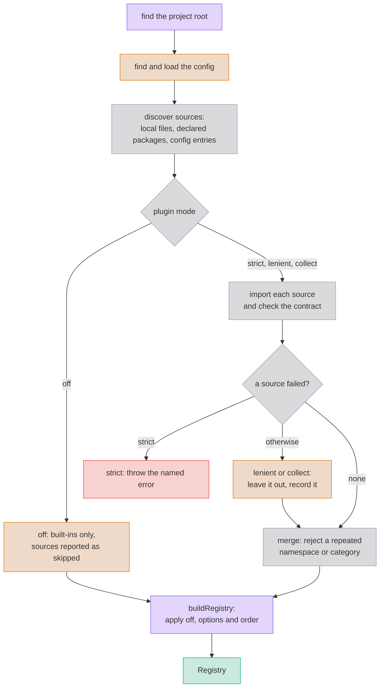
```mermaid
flowchart TB
    ROOT["find the project root"]:::build
    CFGF["find and load the config"]:::source
    DISC["discover sources:<br/>local files, declared packages, config entries"]:::ext
    MODE{"plugin mode"}:::decide
    OFF["off: built-ins only,<br/>sources reported as skipped"]:::out
    LOAD["import each source<br/>and check the contract"]:::ext
    FAIL{"a source failed?"}:::decide
    STRICT["strict: throw the named error"]:::bad
    SKIP["lenient or collect:<br/>leave it out, record it"]:::out
    MERGE["merge: reject a repeated<br/>namespace or category"]:::ext
    BUILD["buildRegistry:<br/>apply off, options and order"]:::build
    REG["Registry"]:::gate

    ROOT --> CFGF --> DISC --> MODE
    MODE -- "off" --> OFF --> BUILD
    MODE -- "strict, lenient, collect" --> LOAD --> FAIL
    FAIL -- "strict" --> STRICT
    FAIL -- "otherwise" --> SKIP --> MERGE
    FAIL -- "none" --> MERGE
    MERGE --> BUILD --> REG

    classDef build  fill:#7c3aed36,stroke:#8b5cf6
    classDef source fill:#b4530936,stroke:#d97706
    classDef ext    fill:#52525b36,stroke:#94a3b8
    classDef decide fill:#52525b36,stroke:#94a3b8
    classDef bad    fill:#dc262636,stroke:#ef4444
    classDef out    fill:#b4530936,stroke:#d97706
    classDef gate   fill:#05966936,stroke:#10b981
```

*Detail: 13 nodes.*

</details>

| Part | Where | What it holds |
|---|---|---|
| Config | `src/config.ts` | Which rules are off and each rule's options, checked against the loaded rules |
| Discovery | `src/plugins/discover.ts` | Local files, declared packages and config entries, in that order |
| Loader | `src/plugins/load.ts` | Imports a module, checks it against the contract, and wraps each rule |
| Assembly | `src/plugins/index.ts` | Merges plugins, and rejects a repeated namespace or category |
| Registry | `src/rules/registry.ts` | The active rules, the fix order, the options and the categories |

The registry orders fixers as the built-in fix order, then plugin fixers in load order.
A rule that is off is absent from both the rule list and the fix order.
An interpunct run counts as reported only while its owning rule is on.
The glyph rule reports a run whose owner is off.

A plugin rule is wrapped when it loads.
Its check cannot throw out of the run, its findings carry its own id and file, and its edits carry its own id.
Its fixer then meets the same verification as a built-in, and an edit outside the source is refused before it is spliced.

A rule function may be synchronous or return a promise.
The check engine starts every check at once and waits for all of them.
The fix engine awaits one fixer at a time, in priority order.
[docs/engines.md](engines.md) draws both, and states the stable-text guarantee a fix run ends with.

Frontmatter is the one new view.
`DocModel.frontmatter` reads a leading YAML block lazily.
It holds the whole parsed document, every string at any depth with a path, a line and source offsets, and the top-level entries.
No built-in rule reads it, and verification still counts its words.
[docs/plugins.md](plugins.md) is the guide for writing a rule against all of this.

## Extending the model

### Adding a rule

One rule is one file, named `src/rules/<rule-id>.ts`, exporting one `Rule`.

Every rule module has the same shape, so a reader who has read one has read them all.

```ts
// What the rule guards, and what the fix will and will not do.

import ...

// Rule-local constants and helpers, each with the reason it exists.

const check: Rule["check"] = (ctx) => { ... };

const fix: Rule["fix"] = (ctx) => { ... };

export const pgNNN: Rule = { id: RULE.NAME, category: "...", summary: "...", check, fix };
```

1. Pick the next free id and add it to the `RULE` map in `src/rules/types.ts`.
2. Choose a category from `CATEGORIES`, which is what groups the rule in help and in `RULES.md`.
3. Write `check`, reading only `CheckContext`.
   Read paragraphs through `proseParagraphs` or `proseSentences`, which drop the table cells, unless the rule is about a glyph.
4. Write `fix` if the rule can be fixed without discretion, and leave it out if it cannot.
   A fix reads `FixContext`, which is the same shared data the check read.
   Data derived from the whole document belongs in `ruleContext`, never recomputed inside the rule.
   A helper a second rule turns out to need moves to the module whose data it takes, which the helper table below lists.
5. Register the rule in `RULES` in `src/rules/index.ts`, in id order.
6. Place it in `FIX_ORDER` if it has a fixer, respecting the structure before glyphs before layout sequence.
7. Add a section to `RULES.md` under the rule's category heading.
   `tests/rules-doc.test.ts` holds that document to the code, so a missing section fails CI.
8. Add an adversarial test under `tests/adversarial/` and a fixture pair under `tests/fixtures/fix/` if the rule fixes.

Nothing else needs to change.
The CLI help, the category grouping and the documentation test all read the catalogue.

### Choosing an expectation

The expectation is the strongest claim the edit can honestly make.

Reach for `same-tree` when the edit only moves whitespace.
Reach for `same-shape` when the edit swaps glyphs inside text and leaves node boundaries alone.
Reach for `same-frontmatter-data` when frontmatter is written differently and means the same.
Reach for `replace-paragraph` when one paragraph becomes several blocks.

A weaker claim is not safer.
`same-shape` blanks text before comparing, so it would wave through an edit that changed a word.
That is why the fingerprint check runs first, and runs unconditionally.

### Reusing the helpers

Modules are grouped by what a function takes, not by which half of a rule calls it.
The layers below import strictly downwards, so `text.ts` names no markdown concept and `model.ts` names no rule.

| Module | Takes | Answers |
|---|---|---|
| `text.ts` | strings and ranges | arithmetic and splitting, with no document in sight |
| `model.ts` | source | the views a rule reads |
| `query.ts` | the model, or a view | what may be read, and where something sits in the source |
| `interpunct.ts` | the model | the one derivation more than one rule shares |
| `fix/promote.ts` | a view and a span | the edit that turns a sentence into a list |

| Helper | Module | Use it for |
|---|---|---|
| `first`, `last` | `text.ts` | The ends of a list the caller has proved non-empty, without a cast per rule |
| `within` | `text.ts` | Testing that one range sits inside another |
| `collapse` | `text.ts` | Folding soft line breaks into single spaces |
| `countOf` | `text.ts` | Counting matches of a global pattern, so a reported count and a compared one cannot drift |
| `spansBetween` | `text.ts` | The spans a run of cut points carves out, with the fencepost written once |
| `words` | `text.ts` | Counting the words of a sentence or an item, the one way every rule counts them |
| `sentences` | `text.ts` | Splitting prose on terminals, which is what a check reads |
| `inRanges` | `text.ts` | Testing whether an offset falls in any range, such as a code span |
| `proseParagraphs` | `query.ts` | The paragraphs a rule may read, with table cells already dropped |
| `proseSentences` | `query.ts` | Every sentence of those paragraphs, carrying the view that names the line |
| `textsContaining` | `query.ts` | The prose text nodes holding a glyph, which is what a punctuation rule reports |
| `matchesIn` | `query.ts` | Absolute offsets of a pattern inside one text node, or null when source and value disagree |
| `matchesInAll` | `query.ts` | The same across every direct text of a paragraph |
| `splittableSeparators` | `query.ts` | Every separator a fixer may split on, or null when one of them cannot be trusted |
| `escaped` | `query.ts` | Refusing a glyph the author escaped |
| `sentenceSpan` | `query.ts` | The sentence bounds covering a range a fixer found |
| `sentenceSpans` | `query.ts` | Every sentence of a paragraph, as source offsets |
| `colonsIn` | `query.ts` | The colons of a paragraph as ranges, or null when one cannot be trusted |
| `colonsBefore` | `query.ts` | The colons that could announce a list, for the rule to take the outermost or the innermost |
| `interpunctRuns` | `interpunct.ts` | The shared run data behind punctuation-interpunct-in-prose, list-interpunct-joined-run and list-stacked-interpunct-runs |
| `isFlat`, `isStacked` | `interpunct.ts` | Partitioning runs into the flat ones list-interpunct-joined-run owns and the stacked ones list-stacked-interpunct-runs owns |
| `paragraphsOf` | `interpunct.ts` | Getting from the runs a rule was handed back to the views its fixer needs |
| `RUN_SEPARATOR`, `GLYPH` | `interpunct.ts` | Splitting and counting a run the same way in list-interpunct-joined-run and list-stacked-interpunct-runs |
| `promote` | `fix/promote.ts` | Turning a span into a lead-in and a real markdown list |
| `cleanItem` | `fix/promote.ts` | Trimming a trailing separator or a joining conjunction off one item |
| `itemsOf` | `fix/promote.ts` | A run of source spans as cleaned item text, in document order |
| `itemsBetween` | `fix/promote.ts` | The same from cut points: the shared body of every hidden-list fixer |
| `cleanLeadIn` | `fix/promote.ts` | Normalising the text before a promoted list to end in a colon |
| `ruleContext` | `rules/index.ts` | Building the shared half of the context once per document |

### Rules the extension must not break

- A fixer never guesses.
  An ambiguous case returns no edit, and the finding stays.
- A fixer never re-serialises prose.
  Item and sentence text is sliced from the source.
- An offset belongs to one source.
  Recompute after every accepted edit, which the engine already does by restarting the pass.
- A fence tagged `markdown` or `md` is check only.
  No fix ever rewrites through a fence boundary.
- A fix bug gets its adversarial test before it gets its fix.

## See also

- [`RULES.md`](../RULES.md) for a failing example and the fix for every gate.
- [`GLOSSARY.md`](../GLOSSARY.md) for the canonical name of every term used here.
- [`adrs/index.md`](../adrs/index.md) for the decisions behind these shapes.
- [`CONTRIBUTING.md`](../CONTRIBUTING.md) for setup and how a change is accepted.
