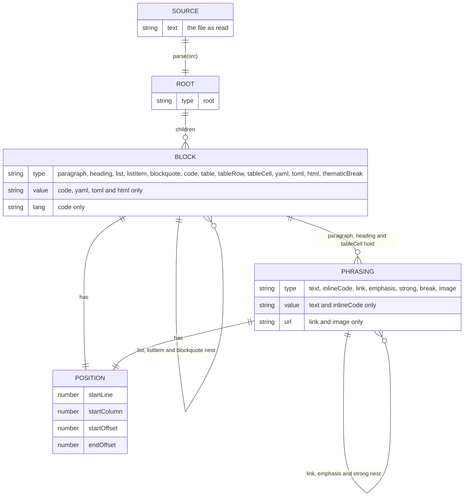
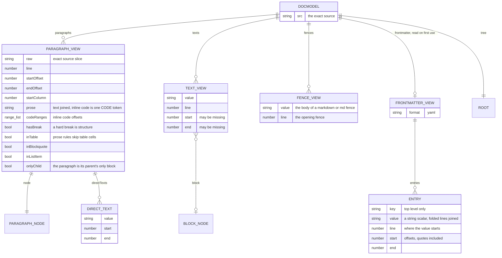
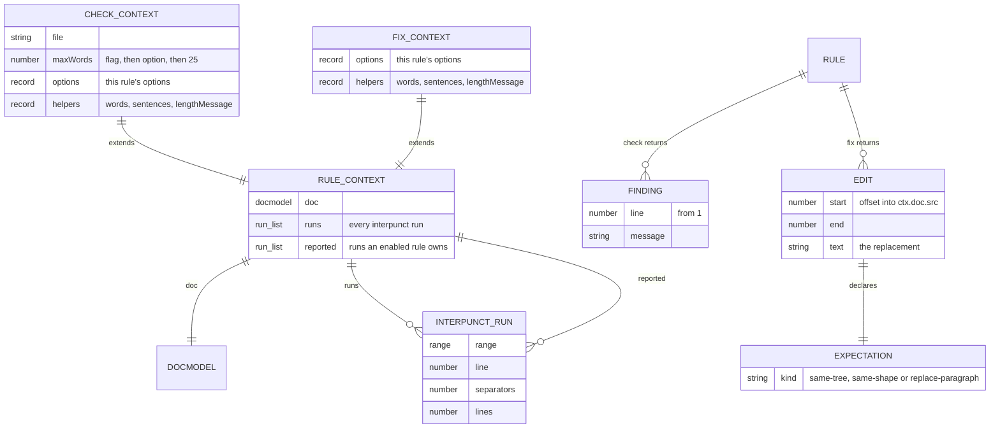
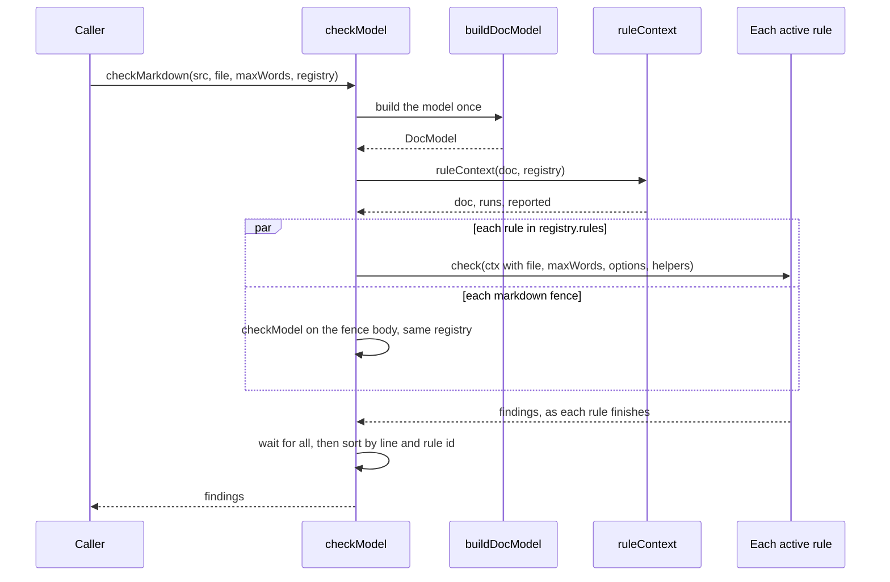
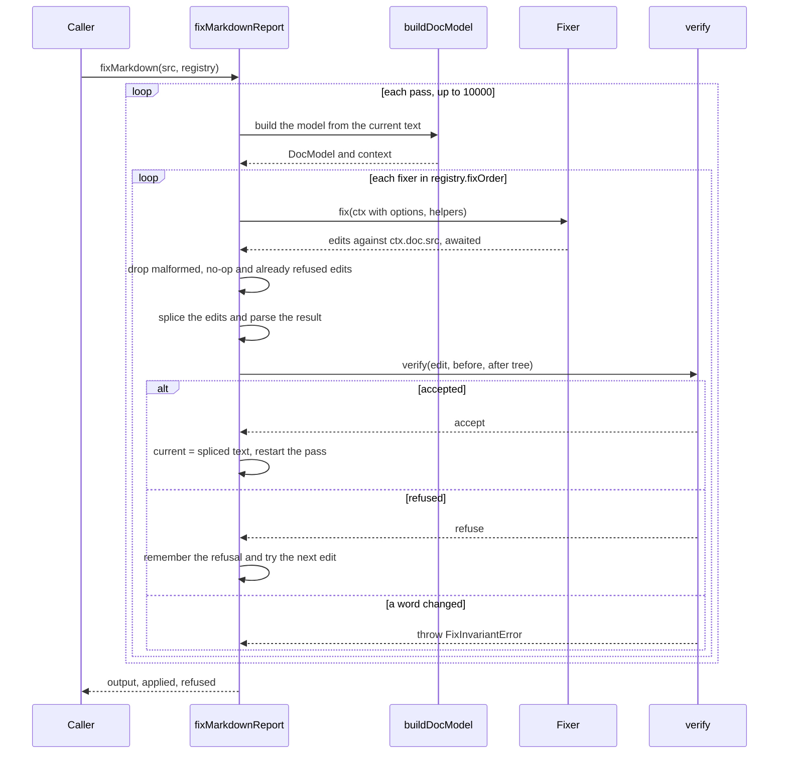
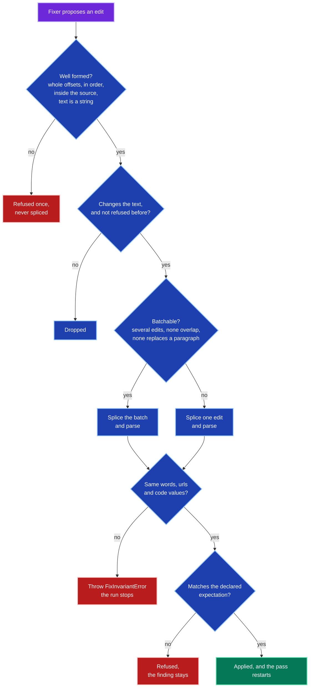
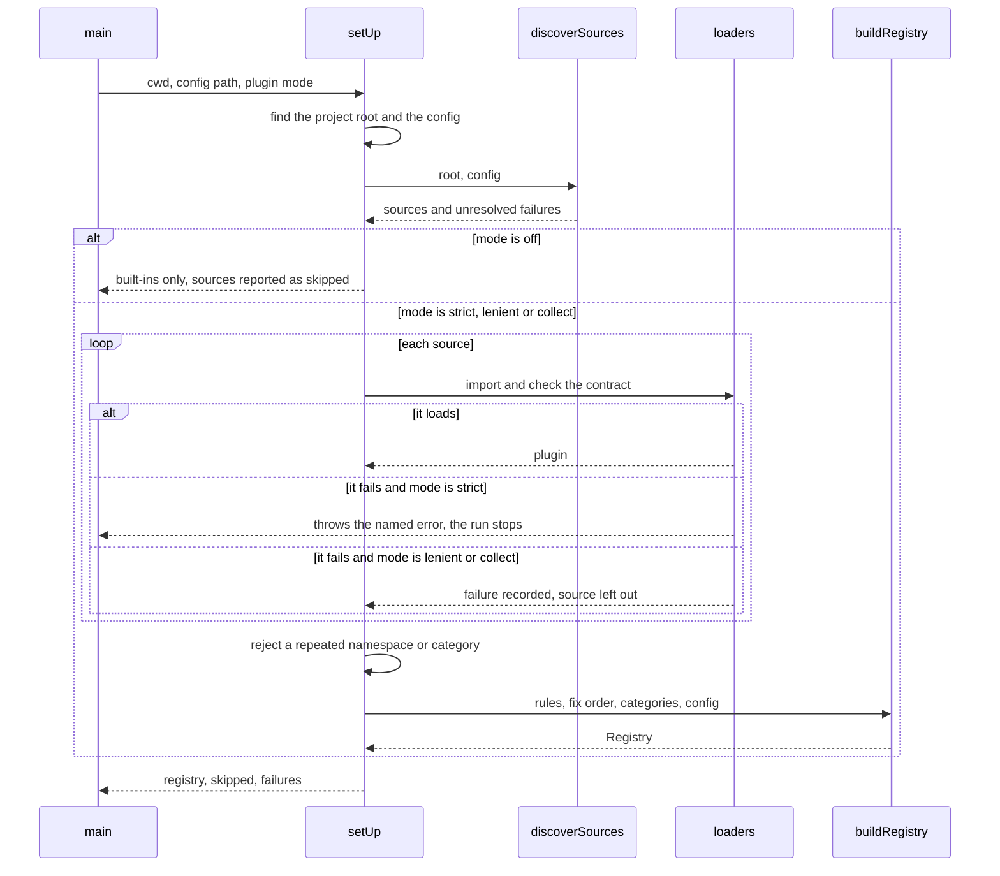

# The check and fix engines

What the markdown tree provides at each point of a run, and the order events happen in.
Read this when you write a rule, and when you need to know what a rule may rely on.
[docs/plugins.md](plugins.md) is the authoring guide, and [DATA_MODEL.md](DATA_MODEL.md) is the reference for the model itself.

## Contents

- [Two engines, one model](#two-engines-one-model)
- [The tree](#the-tree)
- [The views a rule reads](#the-views-a-rule-reads)
- [What each context holds](#what-each-context-holds)
- [The check engine](#the-check-engine)
- [The fix engine](#the-fix-engine)
- [The life of an edit](#the-life-of-an-edit)
- [Setup events](#setup-events)
- [Ordering](#ordering)

## Two engines, one model

Both engines read the same `DocModel`, built from one parse of the source.
The check engine reads the model and reports findings.
The fix engine reads it too, proposes edits, and rebuilds the model after every accepted edit.

| | Check engine | Fix engine |
|---|---|---|
| Entry | `checkMarkdown`, `checkModel` | `fixMarkdown`, `fixMarkdownReport` |
| Returns | A promise of findings | A promise of text, or of a report |
| Source file | `src/check.ts` | `src/fix/engine.ts` |
| Changes the text | Never | Only through verified edits |
| Rule function | `check(ctx)` returns findings, or a promise of them | `fix(ctx)` returns edits, or a promise of them |
| Rules run | All at once, so they overlap | One at a time, in priority order |
| Model lifetime | One model per document | A new model after every accepted edit |
| Rule order matters | No, results are sorted after | Only as a priority, see [Ordering](#ordering) |

## The tree

`parse(src)` returns an mdast `Root` with GitHub-flavoured markdown and frontmatter enabled.
Every node carries a `position` with a line, a column and an offset into the source.
Offsets are what a fixer splices on, so they are valid only for the source they were read from.

Four things to know about the tree.

- **Frontmatter is a block.** A leading `---` block is a `yaml` node, and a leading `+++` block is a `toml` node, so no prose rule sees it.
- **Code is not prose.** `code` and `inlineCode` nodes carry values that no prose rule reads.
- **Tables are blocks of cells.** Each `tableCell` holds phrasing, and the paragraph views mark them `inTable` so prose rules skip them.
- **Positions can be missing.** A text node made of an entity such as `&middot;` has a value that differs from its source slice, so rules map back carefully.

## The views a rule reads

`buildDocModel` walks the tree once and flattens it into the views every rule reads.
A rule should read a view before it reads the tree, because the views already answer the common questions.

| View | Use it to | Do not use it to |
|---|---|---|
| `paragraphs` | Read running prose with its line and offsets | Find text in headings or list markers, which are not paragraphs |
| `texts` | Find a glyph anywhere prose appears, headings included | Split text, because only a direct text of a paragraph carries separators |
| `fences` | See embedded markdown templates | Read ordinary code, which is exempt |
| `frontmatter` | Read the top-level string keys of a YAML block | Read nested keys, numbers or TOML |
| `tree` | Reach a node a view does not cover | Compute offsets, since a view already holds them |

## What each context holds

A rule never receives the model alone.
It receives a context built for that call.

`runs` and `reported` exist because several rules depend on data from the whole document.
They are derived once per document, so a check and its fixer can never disagree about what a run is.

## The check engine

`checkModel` builds one context per document and starts every active rule at once.
No rule sees another rule's findings, and none can change the document.
A rule may be synchronous or return a promise, and the engine waits for all of them.

What a check can rely on:

- **A frozen document.** `ctx.doc` does not change during the call, and neither does any view.
- **Independence.** A rule's result depends on the document, the file, the budget and its options, and on nothing another rule does.
- **A stable order of results.** Findings are sorted by line and then by id, whatever order the rules finished in.
- **A contained failure.** A plugin check that throws, rejects or returns the wrong shape becomes one finding for that rule.
- **Concurrent, not parallel.** JavaScript runs one thread, so synchronous checks run back to back.
  A check that waits on a tool or a service overlaps with the others.

Fences are checked, never fixed.
A fence body is parsed as its own document, and its findings are shifted by the fence's line.

## The fix engine

The fix engine is a loop.
Each pass rebuilds the model from the current text, asks fixers for edits in order, and keeps the first edit that survives verification.

What a fixer can rely on:

- **One fixed text.** Every offset in `ctx.doc` is valid for `ctx.doc.src` in this pass and no other.
- **A fresh model after any change.** An accepted edit ends the pass, so a fixer never sees a half-applied document.
- **A proof, not trust.** Every edit is checked against the words of the document and the shape it declared.
- **A way out.** An edit the engine refuses is remembered, so the fixer is not asked again for the same slice.

A fixer should return edits it is sure of.
When a case is ambiguous it should return nothing, and the finding stays for a person.

## The life of an edit

An edit passes five gates before it changes the text.

The two comparisons read the tree before and after the edit.

| Check | Reads | Passes when |
|---|---|---|
| Fingerprint | Text, inline code, code, html, yaml, toml values, and every url, alt and title | The list of words is identical, ignoring `and`, `or` and enumeration markers |
| `same-tree` | The normalised tree | Equal once text whitespace is collapsed |
| `same-shape` | The tree with every text value blanked | Equal, so only glyphs inside text changed |
| `replace-paragraph` | The tree with one paragraph swapped for the declared fragment | Equal to the reparsed result, and the fragment is one list with the declared item count |

A failed fingerprint throws because it means a fixer lost content, which is a bug.
A failed expectation refuses because it means the fixer could not see its context, which is not.

## Setup events

Before either engine runs, `setUp` builds the registry.
The plugin mode decides what a failed source does.

| Mode | Set by | A failed plugin |
|---|---|---|
| `off` | `--no-plugins` or `"plugins": false` | Nothing is loaded |
| `strict` | The default | Stops the run with the named error |
| `lenient` | `--lenient-plugins` or `"pluginLoading": "lenient"` | Skipped, reported on stderr, the run carries on |
| `collect` | `--validate-plugins` | Recorded, and every failure is reported together |

`--validate-plugins` stops after setup.
It runs no check and no fix, so it is safe to run in CI before any document is read.

## Ordering

Check order does not matter, and fix order is a priority.
This section records what is true today so a plugin does not depend on more.

- **Checks are independent.** Each reads the frozen model and nothing else, so any order gives the same sorted findings.
- **Fixers run one at a time.** Built-ins run in `FIX_ORDER`, then plugin fixers in load order, and each fixer is awaited before the next is asked.
- **The list is a priority.** An accepted edit restarts the pass from the top, so an earlier fixer always gets the next chance.
- **Built-ins defer by data.** The interpunct glyph rule skips a run through `ctx.reported`, not through its place in the list.
- **No ordering properties.** A rule does not declare a phase or an `after` constraint, because the evidence says the built-ins do not need them.
- **Evidence.** Sampled random fixer orders reproduce every fixture and every `RULES.md` example, and the whole test suite passes under them.

A plugin should not assume it runs before or after any other fixer.
It should assume only that any text it is shown may already have been changed by an earlier accepted edit.

## Stable text

One invocation ends at a stable text.
The loop stops only when no fixer, asked again after the last accepted edit, has a verifiable edit left.
Fixing the output again therefore changes nothing, and the property tests hold the engine to that.

This is the guarantee the restart rule buys.
A later fixer can produce text that an earlier fixer would change.
The earlier fixer is asked again, so the run does not end until both are satisfied.

The cost is deliberate.
Each accepted edit asks every earlier fixer again, so the work grows with the rules and the passes.
That is cheap for a handful of rules and will not stay cheap for hundreds of rules over hundreds of files.
Faster options exist, such as tracking which fixers a change could affect, or caching by file hash.
None is built until the cost is real.
